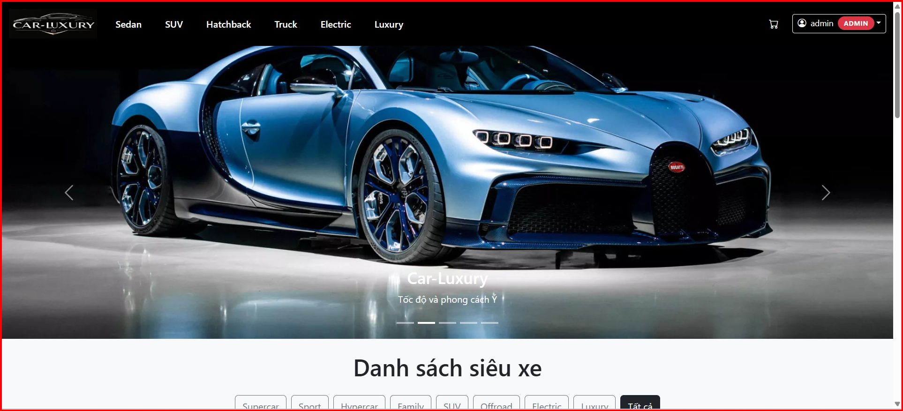
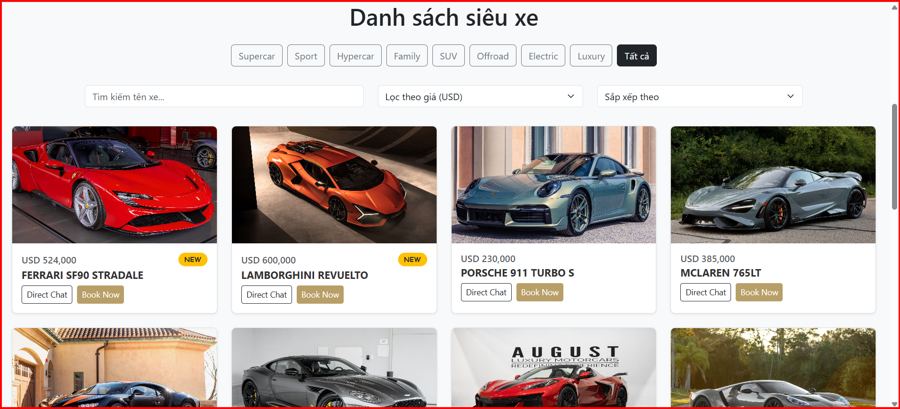
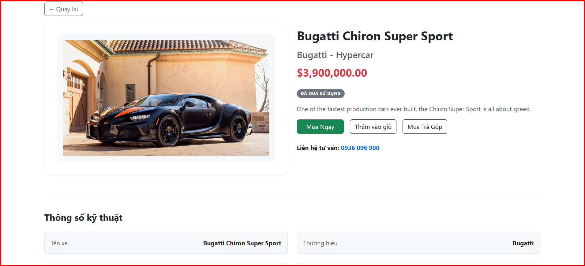

# React + Vite

This template provides a minimal setup to get React working in Vite with HMR and some ESLint rules.

Currently, two official plugins are available:

- [@vitejs/plugin-react](https://github.com/vitejs/vite-plugin-react/blob/main/packages/plugin-react) uses [Babel](https://babeljs.io/) for Fast Refresh
- [@vitejs/plugin-react-swc](https://github.com/vitejs/vite-plugin-react/blob/main/packages/plugin-react-swc) uses [SWC](https://swc.rs/) for Fast Refresh

## Expanding the ESLint configuration

If you are developing a production application, we recommend using TypeScript with type-aware lint rules enabled. Check out the [TS template](https://github.com/vitejs/vite/tree/main/packages/create-vite/template-react-ts) for information on how to integrate TypeScript and [`typescript-eslint`](https://typescript-eslint.io) in your project.

## 🚀 Tính năng nổi bật

- ✅ Danh sách siêu xe phân loại theo: Supercar, SUV, Electric,...
- ✅ Bộ lọc theo loại, tìm kiếm tên, lọc theo giá
- ✅ Sắp xếp theo giá và tình trạng (mới/cũ)
- ✅ Phân trang danh sách xe
- ✅ Xem chi tiết từng xe
- ✅ Carousel banner hấp dẫn
- ✅ Responsive đẹp trên mọi thiết bị
- ✅ Navbar có dropdown người dùng, và thanh tìm kiếm gọn gàng
## 📦 Các thư viện đã sử dụng
🚀 React & Vite
react – Thư viện chính để xây dựng giao diện.

react-dom – Kết nối React với DOM.

vite – Công cụ build và dev server siêu nhanh.

🎨 Giao diện người dùng
bootstrap – Bộ CSS phổ biến để xây dựng giao diện responsive.

react-bootstrap – Component Bootstrap viết lại bằng React (như Navbar, Dropdown, Carousel, Container, ...).

🔗 Routing (Chuyển trang)
react-router-dom – Routing cho ứng dụng React SPA.

📡 Giao tiếp backend / API
axios – Gửi HTTP request để fetch dữ liệu từ JSON server.

🖼️ Icons
bootstrap-icons – Sử dụng qua class "bi bi-cart", "bi bi-person", ...

react-icons (nếu dùng) – Thư viện gói icon tổng hợp (FontAwesome, Bootstrap, Heroicons,...)

🧪 Phát triển & tiện ích (có thể đã dùng)
eslint – Kiểm tra lỗi cú pháp/lint.

vite-plugin-react – Plugin để hỗ trợ React + HMR trong Vite.

## 🖥️ Hướng dẫn chạy project và Cài đặt dependencies

npm install

npx json-server --watch car_infomation.json --port 5000

npx json-server --watch user.json --port 3000

npm run dev

## 🖼️ Giao diện chính

